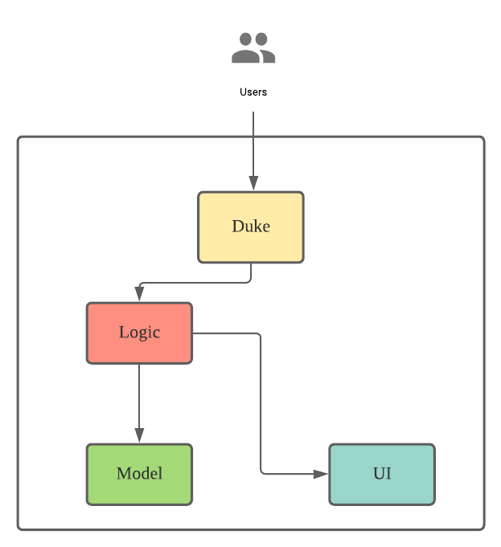
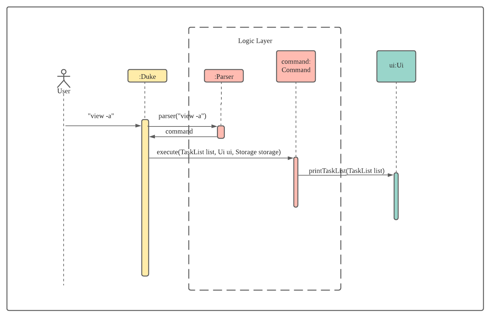
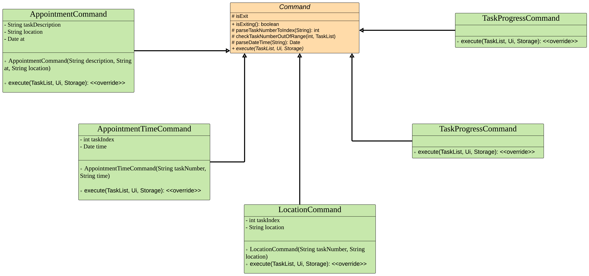
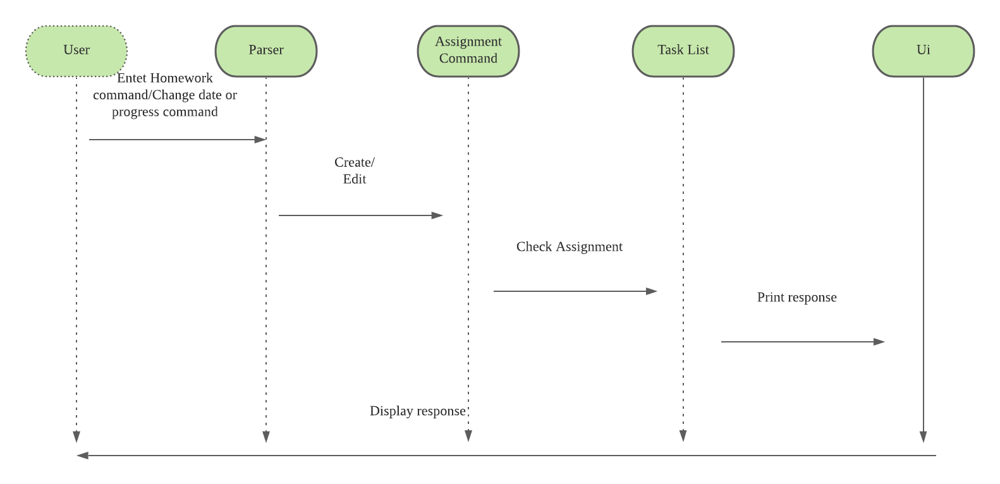
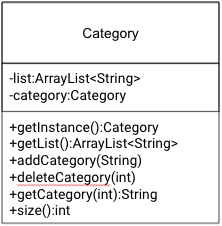
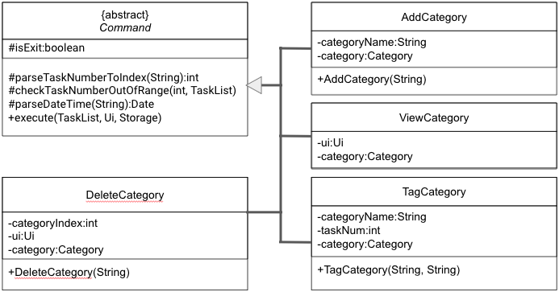
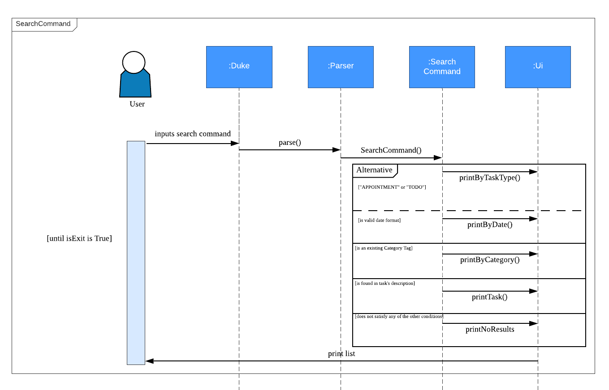

# Developer Guide

## Acknowledgements

Thanks to NUS fundamental code for Duke as well as the idea and inspiration behind this project.

## Design & Implementation

### Architecture

The **_Architecture Diagram_** given above explains the high-level design of the App.

#### Main Class

Main component is the coordinator to handle user input and execute the corresponding task by interacting with logic
layer.

#### Logic Layer

This layer contains two main components, `Parser` and `Command`.

- Parser will parse user input and return a `Command` object to the caller which is `Duke` class
- The `Command` will execute the tasks which corresponds to the user input. It will update the list of `Model`
  information and use `UI` component to print out relevant message.

#### Model Layer

- This layer consists a several `Task` models:

  - `Todo` task: the basic task which contains only the todo description and `done` status.
  - `Appointment` task: apart from the description and status, it also has `time` and `location` attributes.

- The system will generate a list of different `Task` to user.

#### UI Layer

- This layer is only for print different message for user based on the user input.

### Components Interaction

The sequence diagram blow shows how the components interact with each other to achieve desired result. This is taking
example of user input `view -a`.

From the sequence diagram, we can see that a user input `View -a` to and`Duke` class called `Parser.parse` method with the user input to get a `Command` object. The `execute` method of the `Command` object is called to carry out the task.

The reason of doing this is to decouple the parsing logic and task execution logic which is the implementation follows `Single Responsibility Principle`.

### Implementation

The Main flow of the software is to get user input -> parser user input -> execute task -> provide feedback to user regarding the user action.

#### Task execution for create appointment and edit time/location of appointment, checking the progress of the task, as well as exiting the program

For `AppointmentCommand`, `AppointmentTimeCommand`, `ByeCommand`, `LocationCommand`, and `TaskProgressCommand`, they are all extends `Command` class. Please refer to below image for implementation details.

`Command` class is an abstract class which serves as a based class contains some command methods like `parseDateTime` and `checkTaskNumberOutOfRange` for all subclass to use. It also has an abstract method `execute` which enforce each subclass to override the implementation to handle different user input. This follows the `Single Responsibility Principle` and `The Open Closed principle` to keep our code dry reduce the chances to modify the existing codebase thus reduce the regression error.

### Delete feature

It extends `Command` class. It checks if the number input by user is out of range. If yes, error thrown. If no, the task will be deleted from the `TaskList`. `Ui` will print the response.

#### View feature

It extends `Command` class. If user input `-a` together with the command, `Ui` will print all the tasks in the `TaskList` together with the done status. If no, `Ui` will print all the **pending** tasks in the `TaskList` together with the done status.

#### Mark as done feature

It extends `Command` class. It checks if the number input by user is out of range. If yes, error thrown. If no, change the status of the task to done [X].

#### Homework feature
It extends `Command` class. It adds assignments to tasks list and assign marks/due dates/difficulty level and progress. It also allows changing of progress status and due dates.

### Category

### Category Commands

#### AddCategory Command
AddCategory extends `Command` class. It adds a new category to the Category list.

#### DeleteCategory Command
DeleteCategory extends `Command` class. It removes an existing category in the Category list based on the given category number. If an existing category is tagged to a task, an error will throw to prevent deleting of category.

#### TagCategory Command
TagCategory extends `Command` class. It tags an existing category to a task by the provided category number. If the given category number does not exist and error will throw.

#### ViewCategory Command
ViewCategory extends `Command` class. `Ui` will print all the tasks in `Category`.

### Search Command
Search Command extends `Command` class. It filters and prints the task list based on user's input. 

## Product scope
Duke is a task tracker specifically built for computing students that are comfortable with the CLI. Working on improving and adding features to the existing Duke project and making it useful for students to manage their schedule and work. Natural language will be implemented to avoid exceptions due to typing errors. 

### Target user profile
John - 35
Male

Part time student - working adult. Often coming to class late due to work commitment, he would like to be able to track school related tasks that are separated from other commitments outside of school. He finds it difficult to track his work deliverables and his school deliverables separately. So he would like to have a place to write down all the required things that he needs to attend to, so that he can focus on school and work separately. This is to improve his focus in school related submission work.

As a working IT professional, he has a personal laptop with him all the time. And he prefers to use the CLI to track his task as that is what he interacts with the most throughout his day.

### User Flow
He powered up his laptop, and opened the software using Intellij. John sees a todo list, a list of unfinished tasks will be presented to him with the due date of each individual task. He started working on the task, upon finishing the tasks, he keyed in “done {{taskNumber}}” and that task is marked as done in the system. He keyed in “list todos” and saw the task he finished was marked as done.

### Value proposition

Duke is CLI software that helps individuals track the tasks that were keyed in by individual users. It allows users to add tasks, set due dates to a task, update tasks, and mark tasks as done. It also can list the tasks and let the user know how many tasks that user has finished and how many unfinished tasks, as well as the overdue tasks. 

## User Stories

| Version | As a ... | I want to ...                                              | So that I can ...                     |
| ------- | -------- | ---------------------------------------------------------- | ------------------------------------- |
| v1.0    | user     | be able to add a task                                      | keep track which task is not done yet |
| v1.0    | user     | be able to delete a task if that task is not valid anymore | the task list is not cluttered        |
| v1.0    | user     | see the responses from Duke after I enter commands        | know the commands are executed        |
| v1.0    | user     | be able to see all tasks                                   | plan my time                          |
| v2.0    | user     | be able to see unfinished tasks only                       | be more focus on the unfinished tasks |
| v2.0    | user     | mark tasks as done                                         | track the progress                    |
| v2.0    | user     | be able to have different task types                       | search them easily                    |
| v2.0    | user     | be able to add category type                               | tag categories to a task              |
| v2.0    | user     | be able to remove category type                            | the category list is not cluttered    |
| v2.0    | user     | be able to view all category list                          | view which category are available     |
| v2.0    | user     | be able to misspell my commands                            | still input my commands even with typo|
| v3.0    | user     | assign category to task                                    | find related task to a category       |
| v3.0    | user     | be able to rank upcoming assignment in difficulty level    | choose which task to work on first    |
| v3.0    | user     | be able to see how much assignment marks                   | choose which task to work on first    |
| v3.0    | user     | be able to track assignment due date and edit when needed  | complete assignment on time           |
| v3.0    | user     | be able to mark my progress of my assignments              | decide on which assignment needs to get started |
| v3.0    | user     | be able to view task list by task type                     | focus on specific task type when the list is too long |
| v3.0    | user     | be able to view tasks with certain category tag            | focus on specific category tag when the list is too long |
| v3.0    | user     | be able to view tasks with certain date                    | focus on upcoming appointments when the list is too long |
| v3.0    | user     | be able to view tasks that contains certain keywords       | filter my task list when it is too long|

## Non-Functional Requirements

Usability - System should be able to autocorrect some of the low-level typos in user's command inputs.  

## Glossary

- _glossary item_ - Definition

## Instructions for manual testing

1. Download the jar file from Release v3.0
2. Run the application on your preferred terminal - `java -jar tp.jar`
3. To add a task, enter `todo clean my fish tank`
4. To view your task, enter `view`
